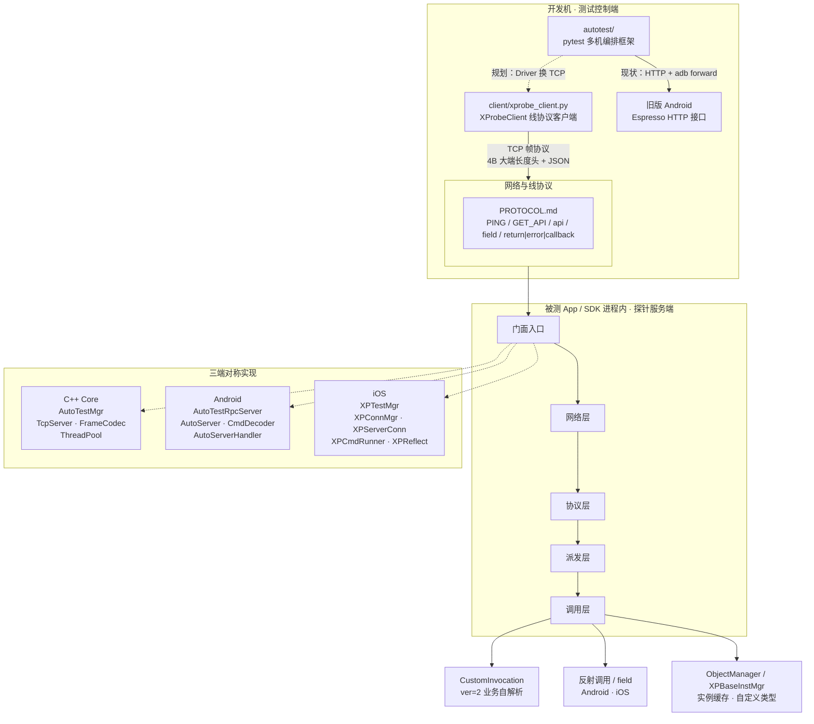
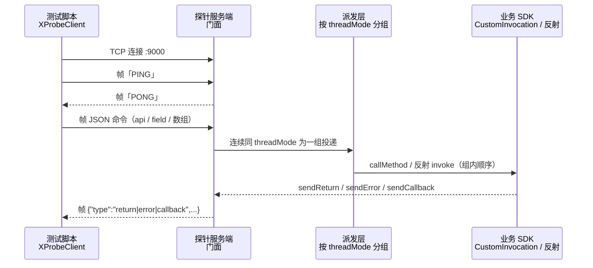

# XplatApiAutoProbe

跨平台 API 自动化探针框架 —— 在被测 App / SDK 进程内启动一个轻量 RPC 服务，让测试脚本（Python 等）通过 TCP 远程调用任意 API、修改成员变量、接收异步回调，实现 UI 无关的自动化测试。

C++ Core / Android / iOS 三端共用同一套帧协议与命令语义，测试脚本零改动跨端复用。

## 特性

- **统一协议**：`4 字节大端长度头 + UTF-8 JSON` 帧，详见 [PROTOCOL.md](PROTOCOL.md)
- **三种调用方式**：
  - `ver=2` 自定义调用 —— 业务注册 `CustomInvocation`，自行解析分发（三端均支持）
  - `ver=1` 反射调用 —— 直接调用类静态方法 / 实例方法（**仅 Android / iOS**；C++ Core 无反射）
  - `field` 命令 —— 反射修改静态成员变量 / 对象属性（**仅 Android / iOS**；C++ Core 把整条命令序列化后透传给 `CustomInvocation`）
- **线程模式**：`threadMode=0` 后台线程池执行（默认），`threadMode=1` 投递到平台主线程
- **批量命令**：一条帧内可携带命令数组；**连续相同 `threadMode` 的命令在同一执行器内顺序执行**，`threadMode` 切换会拆成多组，组间在 C++ / Android 上可能并发（跨组回包顺序不保证）。需要整帧有序时请整帧使用同一 `threadMode`
- **返回通道**：统一 `{"type":"return|error|callback","key":...,"value":...}` 帧；回调支持文本与 JSON 两种形式
- **心跳与自省**：`PING/PONG` 保活；`GET_API:<类名>` 反射枚举该类 API 列表（生成测试脚手架）
- **日志回调**：三端统一的日志注入接口，业务与测试用例注册回调即可接收 SDK 内部日志（服务启停、连接增减、命令派发、解析失败等）并自行输出
- **零依赖**：C++ Core 无第三方库；Android 库仅依赖 android.jar；iOS 库仅依赖系统框架；Python 客户端仅用标准库

> ⚠️ **安全须知（使用前必读）**
>
> 本框架是**开发期自动化探针**，不是可对外暴露的服务。服务端监听 `0.0.0.0` 且连接无身份校验，
> 命令帧可反射调用宿主进程内**任意类的任意方法**——**成功建立 TCP 连接的任何一端，
> 都可以在宿主进程内执行任意可达的代码**。
>
> - **禁止**在生产包（对外发布版本）中启用，**禁止**在不可信网络（公网、公共 Wi-Fi、共享办公网）中使用。
> - Android 端有 Release 门禁：非 `debuggable` 构建默认拒绝启动（可显式放行，见下方接入说明）。
> - C++ Core 与 iOS 端**无自动门禁**，由集成方在调用启动接口前自行把关（如用 `#if DEBUG` 包住）。
>
> 完整约束与取舍见 [PROTOCOL.md §8「安全约束」](PROTOCOL.md#8-安全约束使用前提)。

## 架构

整体分两层：**宿主进程内的探针服务端**（三端库）与 **开发机上的测试控制端**（`client/` / `autotest/`）。

- **`client/`（现状）**：通过 [PROTOCOL.md](PROTOCOL.md) 约定的 TCP 帧与探针通信。
- **`autotest/`（现状）**：仍走 **HTTP + adb forward** 与旧版 Espresso 被测端通信，**尚未**接入本仓库 TCP 探针；图中虚线为规划演进路径。



### 分层说明

| 层 | 职责 | C++ Core | Android | iOS |
|---|---|---|---|---|
| **门面** | 启停服务、回包 API | `AutoTestMgr` | `AutoTestRpcServer` | `XPTestMgr` |
| **网络** | TCP 监听、多连接、最近活跃连接回包 | `TcpServer` | `AutoServer` + `TcpChannel` | `XPConnMgr` + `XPServerConn` |
| **协议** | 切帧、JSON 解析、命令对象 | `FrameCodec` / `protocol` | `CmdDecoder` / `CmdEncoder` / `ProtocolUtil` | `XPServerConn` 内切帧 |
| **派发** | `threadMode`、同组顺序执行 | `ThreadPool` + `IMainThreadPoster` | `AutoServerHandler` | `XPCmdRunner` |
| **调用** | 自定义 / 反射 / 改字段 | 仅 `ICustomInvocation`（无反射） | `CustomInvocation` + 反射 + `BaseObjectManager` | `XPCustomInvocation` + `XPReflect` + `XPBaseInstMgr` |

### 端到端数据流（`XProbeClient` → 探针）

下列时序仅描述 **`client/xprobe_client.py`** 与三端探针的现状路径；`autotest` 当前仍是 HTTP，不在此图中。



### 两套测试入口的关系

| 组件 | 作用 | 当前状态 |
|---|---|---|
| [`client/`](client/) | 轻量线协议客户端 + 协议一致性回归 | 协议客户端可通三端；自动化覆盖 PC（`test_client.py`）、iOS（`test_client_ios.py`）、Android（`test_client_android.py`，需 adb 设备） |
| [`autotest/`](autotest/) | 多设备 pytest 编排框架（装机、拉起、step/verify、报告） | 框架完整；设备驱动仍为 **Android HTTP + adb forward**，尚未换成 `XProbeClient` |

目标形态：`autotest` 的 `Driver` 底层改为 `XProbeClient`，Android 继续 `adb forward`，PC 直连，iOS 走 iproxy —— 上层用例脚本三端复用。详见 [autotest/README.md](autotest/README.md)。

## 目录结构

```
XplatApiAutoProbe/
├── PROTOCOL.md          # 统一线协议规范（三端与客户端的共同契约）
├── core/                # C++17 跨平台核心库（Windows / macOS / Linux）
│   ├── include/xprobe/  #   Json / Protocol / TcpServer / ThreadPool / AutoTestMgr / Logger
│   ├── src/
│   └── test/            #   单元+集成测试（ctest）
├── android/             # Android 库（com.xprobe.rpc，AGP 8.x，minSdk 21）
│   └── xprobe/
├── ios/                 # iOS 库（XplatApiAutoProbe pod，CFSocket + NSInvocation）
│   └── xprobe/          #   XP 前缀类：XPTestMgr / XPReflect / XPConnMgr ...
├── demo/                # 三端测试工程（测试面对齐：RTC API + 探针 + UI）
│   ├── pc/              #   PC：CMake + Dear ImGui，`--headless` 供 CI
│   ├── android/         #   Android：Gradle App + Material，引用 android/xprobe
│   └── ios/             #   iOS/macOS：AppKit UI，`--headless` 供 CI
├── client/              # Python 线协议客户端（零依赖）
│   ├── xprobe_client.py       #   XProbeClient 库
│   ├── test_client.py         #   PC demo 一致性测试
│   ├── test_client_ios.py     #   iOS demo 端到端回归
│   └── test_client_android.py #   Android demo（adb）端到端回归
└── autotest/            # 桌面端多机自动化测试控制框架（pytest）
    ├── projectConfig.py       #   配置中心（包名 / 环境变量）
    ├── multiTest/             #   Driver · 用例编排 · 设备调度
    ├── command/               #   命令常量与示例命令表
    ├── utils/ · uiauto/       #   adb / 设备池 / UI 权限弹窗
    ├── espressoControl.py     #   APK 安装与 Espresso 拉起
    ├── tests/conftest.py      #   pytest 钩子与命令行参数
    └── taskMgr.py             #   IDE 调试入口
```

## autotest — 多机测试控制框架

### 作用

`autotest/` 是跑在**开发机**上的控制端，不是探针服务端本身。它负责：

1. **发现与分配设备**（`utils/deviceManage.py`）
2. **安装 / 拉起被测 App**（`espressoControl.py` + adb）
3. **按步骤下发命令、等待结果、校验断言**（`multiTest/driver.py` + `multiCaseRun.py`）
4. **多用例调度与结果汇总**（`multiCaseMgr.py`、pytest-html 报告）
5. **处理厂商权限弹窗等 UI 干扰**（`uiauto/`）

探针服务端（本仓库 `core` / `android` / `ios`）在被测进程内收命令；`autotest` 在进程外编排「装机 → 下发 → 校验 → 收日志」。

```
开发机（autotest，pytest）
   │
   ├── Android 被测端   adb forward + HTTP        ← 当前已实现
   ├── PC 被测端        直连 127.0.0.1:9000      ← 未实现（扩展 Driver）
   └── iOS 被测端       iproxy / USB 隧道         ← 未实现（扩展 Driver）
```

> **说明**：本目录从 `sdkautotest` 迁移而来，只带了控制端框架，**未搬运具体业务用例**（`tests/` 下目前只有 `conftest.py`）。接入时需自行编写 pytest 用例，或把 `Driver` 换成 `client/xprobe_client.py` 后再写用例。

### 如何运行

**1. 环境**

```bash
cd autotest
python3 -m venv .venv && source .venv/bin/activate   # Windows: .venv\Scripts\activate
pip install -r requirements.txt
```

- 建议 Python ≤ 3.7（代码仍含 `reload(sys)` / `urllib2` 等兼容写法；更高版本需先处理兼容项，见 [autotest/README.md](autotest/README.md#已知问题)）
- Android 设备 USB 调试开启，`adb devices` 能看到设备

**2. 配置**

在 `projectConfig.py` 填写被测包名，或用环境变量覆盖（敏感项不要写进仓库）：

```bash
export XPROBE_CLIENT_PACKAGE=com.example.app
export XPROBE_TEST_PACKAGE=com.example.app.test
export XPROBE_MAIN_ACTIVITY=com.example.app/.MainActivity
export XPROBE_TEST_RUNNER=com.example.app.test/androidx.test.runner.AndroidJUnitRunner
# 完整列表见 autotest/README.md「配置」
```

**3. 执行**

本目录**未附带业务用例**；直接 `python taskMgr.py` 只会打印指引并退出（退出码 2），不会去跑不存在的路径。

```bash
# 写好用例后，用 pytest 直接指定（推荐）
pytest -s tests/p0/test_your_case.py::TestMultiCase::test_Foo \
  --devices=<did1>,<did2> \
  --appid=<appid> --uid1=<uid> --channel1=<channel> \
  --html=report.html

# 或：编辑 taskMgr.py 里的 CASE 常量指向真实用例路径后，再 python taskMgr.py
```

常用命令行参数（定义在 `tests/conftest.py`）：

| 参数 | 含义 |
|---|---|
| `--devices` | 设备序列号，逗号分隔 |
| `--appid` / `--uid1` / `--uid2` / `--uid3` | 业务账号参数 |
| `--channel1` / `--channel2` | 房间 / 频道号 |
| `--html=` | pytest-html 报告路径 |

**4. 接到本仓库探针（推荐演进路径）**

1. `multiTest/driver.py` 传输层从「HTTP + adb forward」换成 `client/xprobe_client.py`
2. 通道：Android 仍 `adb forward tcp:<host> tcp:9000`；PC 直连；iOS 走 iproxy
3. `command/sample/multiCommand.py` 换成 PROTOCOL.md §4 的命令表

更细的目录职责、清洗说明与已知问题见 **[autotest/README.md](autotest/README.md)**。

## 日志回调（三端统一）

接收 SDK 内部日志（服务启停、连接增减、命令派发/执行、解析失败等），业务与测试用例统一走此接口输出。日志级别三端一致：`0=VERBOSE, 1=DEBUG, 2=INFO, 3=WARN, 4=ERROR`；未注册时走各平台默认输出（C++ → stdout/stderr，Android → logcat，iOS → NSLog）。

```cpp
// C++
#include "xprobe/logger.h"
xprobe::setLogCallback([](int level, const std::string& tag, const std::string& msg) {
    // 自行输出：写文件 / 接入现有日志系统 / 按级别过滤
});
xprobe::setLogCallback(nullptr);  // 恢复默认输出
```

```java
// Android
AutoTestRpcServer.setLogCallback((level, tag, message) ->
        Log.println(level, "MyTag", "[" + tag + "] " + message));
```

```objc
// iOS
XPLogSetHandler(^(XPLogLevel level, NSString *tag, NSString *message) {
    // 自行输出：写文件 / 接入现有日志系统 / 按级别过滤
});
```

## 快速开始

### C++（Windows / macOS / Linux）

`AutoTestMgr` **不是单例**，由宿主持有生命周期：

```cpp
#include "xprobe/AutoTestMgr.h"

class MyInvocation : public xprobe::ICustomInvocation {
public:
    explicit MyInvocation(xprobe::AutoTestMgr* mgr) : mgr_(mgr) {}
    void callMethod(const std::string& apiName, const xprobe::JsonValue& params) override {
        if (apiName == "createEngine") {
            int ret = doCreateEngine(params["appId"].asString());
            mgr_->sendReturn("createEngine", std::to_string(ret));
        }
    }
private:
    xprobe::AutoTestMgr* mgr_;
};

int main() {
    xprobe::AutoTestMgr mgr;
    MyInvocation invocation(&mgr);
    mgr.start(&invocation);   // 默认端口 9000
    // ... 业务主循环 / 等待退出信号
    mgr.stop();
}
```

构建与测试：

```bash
# PC 测试工程（推荐 x64，使用 third_party/thunderbolt）
cmake -S demo/pc -B demo/pc/build -A x64
cmake --build demo/pc/build --config Debug
./demo/pc/build/Debug/xprobe_demo.exe           # 启动宿主服务（Win32 UI）
./demo/pc/build/Debug/xprobe_demo.exe --headless
```

其中 `demo/pc` 通过 `add_subdirectory` 复用 `core` 的核心库；Thunderbolt 3.5.10 SDK
见 [`demo/pc/third_party/thunderbolt`](demo/pc/third_party/thunderbolt)。Android 与 iOS
测试工程见 [demo/README.md](demo/README.md)。

### Android

```gradle
// settings.gradle: include ':xprobe'
implementation project(':xprobe')
```

```java
// Application.onCreate 中启动，三种方式任选
AutoTestRpcServer.start(this, new ObjectManager());                              // 仅反射调用
AutoTestRpcServer.start(this, new MyCustomInvocation());                         // 仅自定义调用
AutoTestRpcServer.start(this, new ObjectManager(), new MyCustomInvocation());    // 两者同时
```

反射调用时继承 `BaseObjectManager` 提供：`getObject`（缓存实例）、`isInitialize`（SDK 初始化判断）、`generateCustomType`（自定义类型构造）、`getSDKPackageName`（默认包名）。

**Release 包默认拒绝启动**：非 `debuggable` 构建调用上面的 `start` 会直接返回并记错误日志，
服务不会起来。确为受控内测场景时，须在 `start` 之前显式放行：

```java
AutoTestRpcServer.allowInReleaseBuild(true);   // 接受 §安全 中的后果后才可调用
AutoTestRpcServer.start(this, new ObjectManager());
```

### iOS

```ruby
pod 'XplatApiAutoProbe'
```

```objc
#import <XplatApiAutoProbe/XplatApiAutoProbe.h>

// 实现协议
@interface MyInstMgr : NSObject <XPBaseInstMgr> @end
@interface MyInvocation : NSObject <XPCustomInvocation> @end

// 启动（instMgr / custInvoc 可为 nil，默认端口 9000）
[[XPTestMgr sharedInstance] startTestWithInstMgr:[MyInstMgr new] CustInvoc:[MyInvocation new]];
```

### Python 测试客户端

```python
from xprobe_client import XProbeClient

with XProbeClient("127.0.0.1", 9000) as c:
    assert c.ping()
    ret = c.call("createEngine", {"appId": "123", "sceneId": 1})   # ver=2
    print(ret)            # {"type": "return", "key": "createEngine", "value": "0"}
    c.call_batch([...])   # 数组命令；同 threadMode 组内顺序执行
```

## 命令速览

| 命令 | 形式 | 说明 |
|---|---|---|
| 自定义调用 | `{"api":{"apiName":"x","params":{...}},"threadMode":1,"ver":2}` | 透传给 `CustomInvocation`（三端） |
| 反射调用 | `{"api":"com.foo.Bar.add","param_type":[...],"param_value":[...]}` 或嵌套形式 | **Android / iOS**；静态方法优先，其次缓存实例 |
| 修改成员 | `{"field":"com.foo.Config","param_name":[...],"param_type":[...],"param_value":[...]}` | **Android** 反射字段；**iOS** 反射 setter；C++ 无反射 |
| 心跳 | 文本帧 `PING` | 回复 `PONG` |
| API 自省 | 文本帧 `GET_API:<类名>` | 返回该类方法元数据 JSON 数组（C++ 返回 `[]`） |

返回帧：`{"type":"return|error|callback","key":"apiName","value":"..."}`，完整规范见 [PROTOCOL.md](PROTOCOL.md)。

## 测试

```bash
# C++ Core 单元/集成测试（JSON / 帧编解码 / 命令解析 / 线程池 / TCP 集成 / 跨端契约）
cmake -S core -B core/build && cmake --build core/build && ctest --test-dir core/build

# Python 客户端一致性测试（自动拉起 PC demo，10 例）
python3 client/test_client.py

# iOS 端到端回归（自动构建 demo/ios 宿主，10 例）
python3 client/test_client_ios.py

# Android 端到端回归（需 adb 在线设备；自动 gradle 构建 / 安装 / adb forward）
python3 client/test_client_android.py

# 多机业务用例框架（需自备用例与 Android 设备，见上文「autotest」）
cd autotest && pip install -r requirements.txt && python taskMgr.py
```

Android 库全部源码通过 `javac`（android.jar classpath）零错误编译；iOS 库通过 `-fsyntax-only -Wall -Wextra` 零警告，并以 macOS 宿主完成端到端协议测试。

## License

[MIT](LICENSE)
